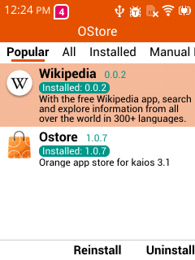
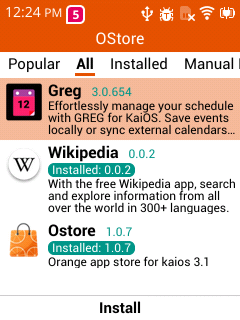
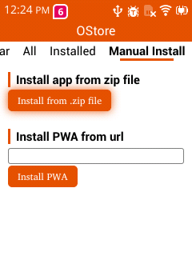

# OStore-Solid

Orange app store for KaiOS 3.1

This app is built into the system image of [nokia 2780 flip](https://github.com/gogogoghost/nokia-2780-flip-jailbreak-tutorial).

## Screenshots

## Where are the apps from?

- My porting and packaging
- Uploads by authors

## How to upload your app

OStore has an api to publish your newest version.

https://api-ostore.yexm.eu.org/publish

POST multipart/form-data

| Field | Type   | Description          |
|-------|--------|----------------------|
| id    | string | App's ID             |
| file  | file   | Zip File             |
| sign  | file   | The ED25519 signature binary of the ZIP file  |

But for the first version you have to send the zip file and the DER format ed25519 public key to my email: **jaxyang39@gmail.com**.

I will publish your first version and then you can upgrade by yourself.